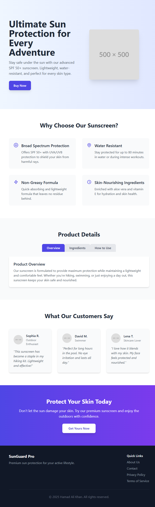

# 🌞 Sun Protection App

[](https://hamadalikhan022.github.io/Sun-Protection-App/)
[](https://reactjs.org/)
[](https://tailwindcss.com/)

A modern and fully responsive **Sun Protection Product Website** built with **React.js** and **Tailwind CSS**. Designed as part of an internship task under the supervision of **Areeb Tariq** and **Ahmad Ali**.

🔗 **Live Website**: [https://hamadalikhan022.github.io/Sun-Protection-App/](https://hamadalikhan022.github.io/Sun-Protection-App/)

---

## 📸 Screenshot



> *Ensure `screenshot.png` is placed in the `public/` folder or adjust path as needed.*

---

## ✨ Features

- ✅ Clean & Minimal UI Design
- 📱 Mobile-First Responsive Layout
- ⚛️ Component-Based Architecture (React)
- 🎨 Tailwind CSS Styling
- 🚀 Fast and Lightweight Deployment

---

## 🛠️ Technologies Used

| Tech           | Description                      |
|----------------|----------------------------------|
| React JS       | Frontend Library (SPA)           |
| Tailwind CSS   | Utility-first CSS Framework      |
| JSX / JavaScript | UI Logic and Interactions     |
| HTML5 & CSS3   | Semantic Layout & Styling        |
| GitHub Pages   | Deployment Platform              |

---

## 📁 Project Structure

Sun-Protection-App/
├── public/
│ └── screenshot.png
├── src/
│ ├── components/ # All reusable components
│ ├── assets/ # Static images & icons
│ ├── App.jsx
│ └── index.js
├── tailwind.config.js
├── postcss.config.js
├── package.json
└── README.md

---

## 🚀 Getting Started

### Prerequisites

- Node.js and npm installed

### Installation

```bash
git clone https://github.com/HamadAliKhan022/Sun-Protection-App.git
cd Sun-Protection-App
npm install
npm start
npm run build
npm install --save gh-pages
npm run deploy

---

### 📌 Instructions:
1. Save the above as `README.md` in your root directory.
2. Add a screenshot of your live app and name it `screenshot.png` inside the `public/` folder.
3. Commit and push.
